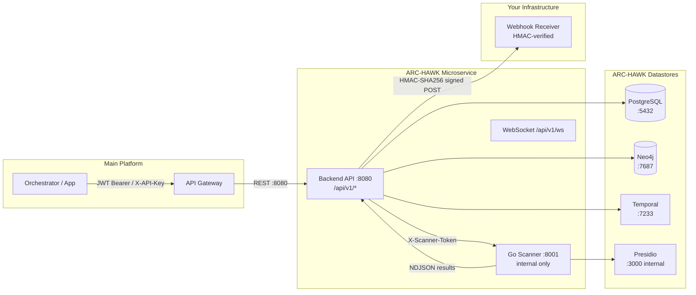

# ARC-HAWK Integration Guide

End-to-end walkthrough for embedding ARC-HAWK as a microservice in a main platform.

---

## Architecture



**External surface**: only `:8080` is exposed to the host network. The Go scanner (`:8001`), Presidio, Temporal, PostgreSQL, and Neo4j run on an internal Docker bridge and are never reachable from the host or parent system directly.

---

## Authentication

ARC-HAWK supports two auth schemes on all `/api/v1/*` endpoints. Either may be used; both are accepted in parallel.

### 1. JWT Bearer Token

Obtain a token by logging in:

```
POST /api/v1/auth/login
Content-Type: application/json

{
  "email": "user@example.com",
  "password": "s3cr3t"
}
```

Response:

```json
{
  "token": "eyJhbGci...",
  "expires_at": "2026-05-22T00:00:00Z",
  "user": { "id": "uuid", "email": "user@example.com" }
}
```

Use the token on every request:

```
Authorization: Bearer eyJhbGci...
```

JWTs expire; re-authenticate to obtain a fresh token. The JWT payload includes the user ID and permission scopes used by the policy middleware.

### 2. API Key (`X-API-Key`)

Long-lived keys are stored in the `api_keys` table (migration `000028`). Issue a key via the admin API or directly in the database, then pass it in the header:

```
X-API-Key: ark_live_xxxxxxxxxxxxxxxx
```

The middleware validates the key, records `last_used_at`, and populates the request context with the key's scopes. API keys do not expire unless revoked.

### Tenant Model

ARC-HAWK is single-tenant by default. The `tenant_id` field on resources isolates data when multi-tenant mode is configured. The Go scanner forwards `X-Tenant-ID` on ingest calls; the backend uses this to scope findings and audit log entries.

### Permission Scopes

| Scope | Grants |
|-------|--------|
| `scan:trigger` | `POST /scans/trigger` |
| `scan:read` | `GET /scans/*`, `GET /findings` |
| `connection:write` | `POST /connections` |
| `remediation:execute` | `POST /remediation/execute` |
| `compliance:read` | `GET /compliance/*`, `GET /audit/*` |
| `admin:*` | All endpoints |

---

## Core Integration Flows

### Flow 1 — Register a Data Source

```
POST /api/v1/connections
Authorization: Bearer <token>
Content-Type: application/json

{
  "name": "prod-postgres",
  "source_type": "postgresql",
  "config": {
    "host": "db.internal",
    "port": 5432,
    "database": "myapp",
    "username": "scanner_ro",
    "password": "..."
  }
}
```

Response `201`:

```json
{
  "id": "conn-uuid",
  "name": "prod-postgres",
  "source_type": "postgresql",
  "status": "active",
  "created_at": "2026-04-22T10:00:00Z"
}
```

Credentials are AES-256 encrypted at rest. The API never returns raw credentials.

### Flow 2 — Trigger a Scan

```
POST /api/v1/scans/trigger
Authorization: Bearer <token>
Content-Type: application/json

{
  "connection_id": "conn-uuid",
  "scan_name": "nightly-pii-scan"
}
```

Response `202`:

```json
{
  "scan_id": "scan-uuid",
  "status": "pending",
  "message": "Scan queued"
}
```

Only **one concurrent scan per tenant** is allowed. A second trigger while a scan is running returns `409 Conflict`.

### Flow 3 — Poll Scan Status

```
GET /api/v1/scans/{scan_id}/status
Authorization: Bearer <token>
```

Response:

```json
{
  "id": "scan-uuid",
  "status": "running",
  "progress": 47,
  "created_at": "2026-04-22T10:01:00Z",
  "completed_at": null,
  "total_findings": null,
  "error_message": null
}
```

`status` values: `pending` | `running` | `completed` | `failed` | `cancelled`

Recommended poll interval: 5 s while `running`, back off to 30 s after 5 minutes.

### Flow 4 — Retrieve Findings

```
GET /api/v1/findings?scan_id=scan-uuid&page=1&page_size=100
Authorization: Bearer <token>
```

Response:

```json
{
  "findings": [
    {
      "id": "finding-uuid",
      "scan_id": "scan-uuid",
      "asset_name": "users_table",
      "asset_path": "myapp.public.users",
      "field": "email",
      "pii_type": "EMAIL_ADDRESS",
      "confidence": 0.98,
      "risk_score": 82,
      "risk": "High",
      "source_type": "Database"
    }
  ],
  "total": 1888,
  "page": 1,
  "page_size": 100
}
```

### Flow 5 — Apply Remediation

Preview first (always recommended):

```
POST /api/v1/remediation/preview
Authorization: Bearer <token>
Content-Type: application/json

{
  "finding_id": "finding-uuid",
  "action": "mask"
}
```

Execute (requires `REMEDIATION_ENABLED=true` env var and `remediation:execute` scope):

```
POST /api/v1/remediation/execute
Authorization: Bearer <token>
Content-Type: application/json

{
  "finding_id": "finding-uuid",
  "action": "mask"
}
```

Response `200`:

```json
{
  "action_id": "action-uuid",
  "status": "applied",
  "applied_at": "2026-04-22T10:15:00Z"
}
```

---

## Webhook Contract

ARC-HAWK delivers real-time events to your webhook receiver via HMAC-signed HTTP POST requests.

### Configuration

Set in the backend environment:

```
WEBHOOK_URL=https://your-platform.internal/arc-hawk-events
WEBHOOK_SECRET=<random-32-bytes-min>
```

### Events Delivered

| Event | When |
|-------|------|
| `scan.started` | Scan transitions from `pending` to `running` |
| `scan.progress` | Every 10% progress increment |
| `scan.completed` | Scan finishes successfully |
| `finding.created` | High/Critical finding ingested (real-time) |
| `remediation.applied` | Remediation action executed |

### Payload Envelope

```json
{
  "event_id": "evt-uuid",
  "event": "scan.completed",
  "tenant_id": "tenant-uuid",
  "timestamp": "2026-04-22T10:30:00Z",
  "data": { ... }
}
```

`event_id` is stable and unique — use it for deduplication.

### HMAC Signature Verification

Every delivery includes:

```
X-ARC-Signature: sha256=<hex-digest>
```

Verify in your receiver:

```go
mac := hmac.New(sha256.New, []byte(os.Getenv("WEBHOOK_SECRET")))
mac.Write(bodyBytes)
expected := "sha256=" + hex.EncodeToString(mac.Sum(nil))
if !hmac.Equal([]byte(expected), []byte(header)) {
    // reject
}
```

Always verify before processing. See [docs/WEBHOOKS.md](./WEBHOOKS.md) for full event schemas and retry policy.

---

## Rate Limits

| Limit | Value |
|-------|-------|
| Requests per minute | 100 per IP (token-bucket, burst 100) |
| Concurrent scans per tenant | 1 |
| WebSocket connections | 50 concurrent |

When the rate limit is exceeded the API returns `429 Too Many Requests` with a `Retry-After` header.

---

## Error Envelope

All errors use a consistent JSON envelope:

```json
{
  "error": "SCAN_IN_PROGRESS",
  "message": "A scan is already running for this tenant",
  "status": 409,
  "details": { "scan_id": "scan-uuid" }
}
```

| HTTP Status | Meaning |
|-------------|---------|
| 400 | Invalid request body or parameters |
| 401 | Missing or expired JWT / invalid API key |
| 403 | Valid identity but insufficient permission scope |
| 404 | Resource not found |
| 409 | Conflict (duplicate scan, duplicate connection name) |
| 429 | Rate limit exceeded |
| 500 | Internal server error |
| 503 | Dependency unhealthy (check `/readyz`) |

---

## Health Endpoints

| Endpoint | Purpose | Success | Failure |
|----------|---------|---------|---------|
| `GET /livez` | Liveness — is the process alive? | `200 {"status":"alive"}` | Never fails while process runs |
| `GET /readyz` | Readiness — are dependencies up? | `200 {"status":"ready",...}` | `503 {"status":"unavailable",...}` |
| `GET /health` | Back-compat alias for `/readyz` | Same as `/readyz` | Same as `/readyz` |

`/readyz` checks PostgreSQL connectivity and Neo4j connectivity. Use `/livez` for Kubernetes liveness probes and `/readyz` for readiness probes.

Go scanner health:

```
GET http://go-scanner:8001/health     (internal Docker network only)
```

---

## SDK Snippets

### curl

```bash
# Login
TOKEN=$(curl -s -X POST http://localhost:8080/api/v1/auth/login \
  -H "Content-Type: application/json" \
  -d '{"email":"admin@example.com","password":"changeme"}' \
  | jq -r .token)

# Create connection
curl -s -X POST http://localhost:8080/api/v1/connections \
  -H "Authorization: Bearer $TOKEN" \
  -H "Content-Type: application/json" \
  -d '{"name":"my-pg","source_type":"postgresql","config":{"host":"db","port":5432,"database":"myapp","username":"ro","password":"pass"}}'

# Trigger scan
SCAN_ID=$(curl -s -X POST http://localhost:8080/api/v1/scans/trigger \
  -H "Authorization: Bearer $TOKEN" \
  -H "Content-Type: application/json" \
  -d '{"connection_id":"conn-uuid","scan_name":"test-scan"}' \
  | jq -r .scan_id)

# Poll status
curl -s "http://localhost:8080/api/v1/scans/$SCAN_ID/status" \
  -H "Authorization: Bearer $TOKEN" | jq .

# Get findings
curl -s "http://localhost:8080/api/v1/findings?scan_id=$SCAN_ID" \
  -H "Authorization: Bearer $TOKEN" | jq .
```

### Go Client

```go
package main

import (
    "bytes"
    "encoding/json"
    "fmt"
    "net/http"
)

const baseURL = "http://localhost:8080/api/v1"

func triggerScan(token, connectionID, scanName string) (string, error) {
    body, _ := json.Marshal(map[string]string{
        "connection_id": connectionID,
        "scan_name":     scanName,
    })
    req, _ := http.NewRequest("POST", baseURL+"/scans/trigger", bytes.NewReader(body))
    req.Header.Set("Authorization", "Bearer "+token)
    req.Header.Set("Content-Type", "application/json")

    resp, err := http.DefaultClient.Do(req)
    if err != nil {
        return "", err
    }
    defer resp.Body.Close()

    var result struct {
        ScanID string `json:"scan_id"`
    }
    json.NewDecoder(resp.Body).Decode(&result)
    return result.ScanID, nil
}

func main() {
    scanID, err := triggerScan("eyJhbGci...", "conn-uuid", "my-scan")
    if err != nil {
        panic(err)
    }
    fmt.Println("scan_id:", scanID)
}
```

### TypeScript (fetch)

```typescript
const BASE_URL = "http://localhost:8080/api/v1";

async function login(email: string, password: string): Promise<string> {
  const res = await fetch(`${BASE_URL}/auth/login`, {
    method: "POST",
    headers: { "Content-Type": "application/json" },
    body: JSON.stringify({ email, password }),
  });
  const data = await res.json();
  return data.token as string;
}

async function triggerScan(token: string, connectionId: string): Promise<string> {
  const res = await fetch(`${BASE_URL}/scans/trigger`, {
    method: "POST",
    headers: {
      Authorization: `Bearer ${token}`,
      "Content-Type": "application/json",
    },
    body: JSON.stringify({ connection_id: connectionId, scan_name: "ts-scan" }),
  });
  const data = await res.json();
  return data.scan_id as string;
}

async function pollUntilDone(token: string, scanId: string): Promise<void> {
  while (true) {
    const res = await fetch(`${BASE_URL}/scans/${scanId}/status`, {
      headers: { Authorization: `Bearer ${token}` },
    });
    const data = await res.json();
    if (data.status === "completed" || data.status === "failed") break;
    await new Promise((r) => setTimeout(r, 5000));
  }
}
```

---

## Troubleshooting

| Symptom | Likely Cause | Fix |
|---------|-------------|-----|
| `401 Unauthorized` on all requests | Expired JWT | Re-authenticate via `POST /auth/login` |
| `409 Conflict` on scan trigger | Another scan running | `GET /scans` to find the running scan, cancel with `POST /scans/{id}/cancel` if needed |
| `503` from `/readyz` | PostgreSQL or Neo4j down | `docker-compose ps` to check services; see `db_healthy` / `neo4j_healthy` in response |
| Webhook not received | WEBHOOK_URL or WEBHOOK_SECRET not set | Check env vars; verify your receiver is reachable from the ARC-HAWK container |
| Findings empty after scan completes | Scanner could not reach data source | Check connection credentials with `POST /connections/{id}/test` |
| `429 Too Many Requests` | Rate limit exceeded | Back off and retry after `Retry-After` seconds |

---

## Related Documents

- [docs/WEBHOOKS.md](./WEBHOOKS.md) — Full webhook event schemas and retry policy
- [docs/RUNBOOK_E2E.md](./RUNBOOK_E2E.md) — How to run the whole system end-to-end
- [docs/SCANNER_REFERENCE.md](./SCANNER_REFERENCE.md) — Go scanner internals
- [docs/architecture/INTEGRATION.md](./architecture/INTEGRATION.md) — Architecture-level integration contracts
- [docs/openapi/openapi.yaml](./openapi/openapi.yaml) — OpenAPI spec (coming soon)
