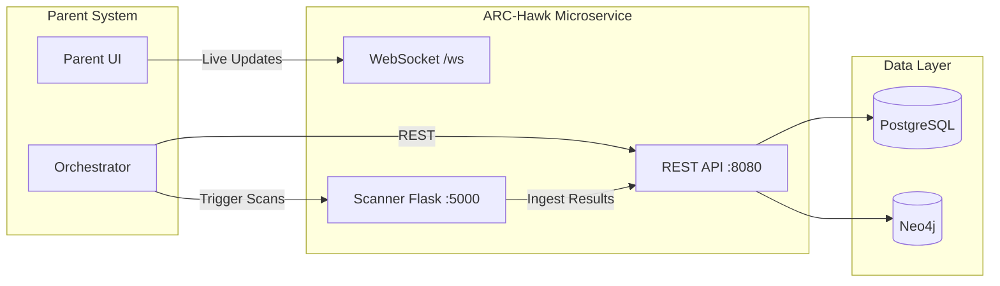
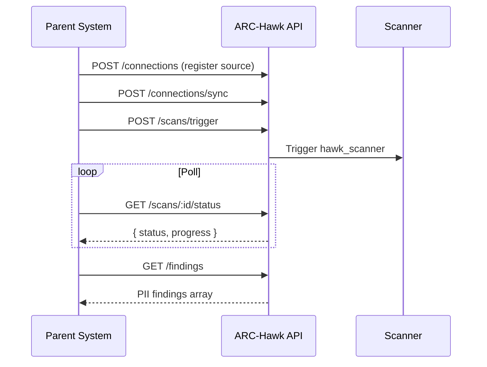
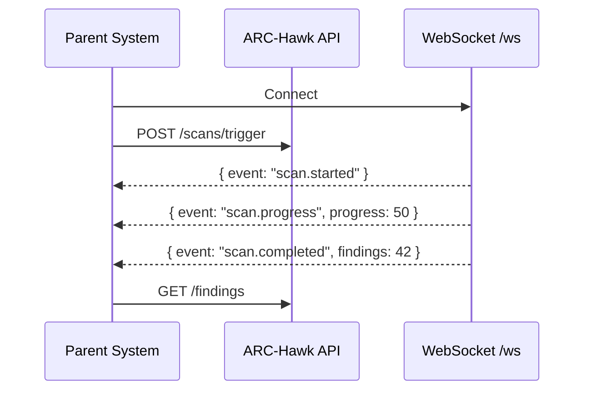

# ARC-Hawk Microservice Integration Guide

> Integration contract for consuming ARC-Hawk as PII discovery/governance microservice.

---

## Architecture Overview



---

## Quick Start

### Health Check
```bash
GET /health → { "status": "UP" }
```

### Required Environment
| Variable | Purpose |
|----------|---------|
| `DATABASE_URL` | PostgreSQL connection |
| `NEO4J_URI` | Neo4j bolt for lineage |
| `SCANNER_URL` | Scanner Flask endpoint |
| `JWT_SECRET` | Auth token signing |
| `ENCRYPTION_KEY` | Credential encryption |

---

## API Reference (v1)

All endpoints under `/api/v1/`. Auth via `Authorization: Bearer <JWT>`.

### Scanning (Core)

| Method | Endpoint | Description |
|--------|----------|-------------|
| `POST` | `/scans/trigger` | Trigger a new PII scan |
| `POST` | `/scans/ingest-verified` | Ingest validated scan results |
| `GET` | `/scans` | List all scans |
| `GET` | `/scans/latest` | Get latest scan |
| `GET` | `/scans/:id` | Get scan details |
| `GET` | `/scans/:id/status` | Poll scan status |
| `POST` | `/scans/:id/complete` | Mark scan complete |
| `POST` | `/scans/:id/cancel` | Cancel running scan |
| `DELETE`| `/scans/clear` | Clear scan data |
| `GET` | `/scans/classification/summary` | PII classification summary |

### Dashboard

| Method | Endpoint | Description |
|--------|----------|-------------|
| `GET` | `/dashboard/metrics` | Aggregated metrics |

### Connections (Data Sources)

| Method | Endpoint | Description |
|--------|----------|-------------|
| `POST` | `/connections` | Register data source |
| `GET` | `/connections` | List data sources |
| `POST` | `/connections/test` | Test credentials |
| `POST` | `/connections/:id/test` | Test existing connection |
| `POST` | `/connections/sync` | Sync to scanner |
| `GET` | `/connections/sync/validate` | Validate sync state |

### Assets & Findings

| Method | Endpoint | Description |
|--------|----------|-------------|
| `GET` | `/assets` | List discovered assets |
| `GET` | `/assets/:id` | Asset details |
| `GET` | `/findings` | List PII findings |
| `POST` | `/findings/:id/feedback` | Mark false positive |
| `GET` | `/dataset/golden` | Golden dataset for tuning |

### Remediation

| Method | Endpoint | Description |
|--------|----------|-------------|
| `POST` | `/remediation/preview` | Preview remediation |
| `POST` | `/remediation/execute` | Execute remediation *(auth: `remediation:execute`)* |
| `GET` | `/remediation/history` | Remediation history |
| `GET` | `/remediation/history/:assetId` | Asset remediation history |
| `GET` | `/remediation/actions/:findingId` | Actions for finding |
| `POST` | `/remediation/rollback/:id` | Rollback remediation |
| `GET` | `/remediation/:id` | Get specific action |

### Compliance

| Method | Endpoint | Description |
|--------|----------|-------------|
| `GET` | `/compliance/overview` | Compliance dashboard |
| `GET` | `/compliance/violations` | Consent violations |
| `GET` | `/compliance/critical` | Critical assets |
| `POST` | `/consent/records` | Record consent |
| `GET` | `/consent/records` | List consent records |
| `POST` | `/consent/withdraw/:id` | Withdraw consent |
| `GET` | `/consent/status/:assetId/:piiType` | Consent status |
| `GET` | `/consent/violations` | Consent violations |
| `POST` | `/retention/policies` | Set retention policy |
| `GET` | `/retention/policies/:assetId` | Get retention policy |
| `GET` | `/retention/violations` | Retention violations |
| `GET` | `/retention/timeline/:assetId` | Retention timeline |
| `GET` | `/audit/logs` | Audit trail |
| `GET` | `/audit/user/:userId` | User activity |
| `GET` | `/audit/resource/:type/:id` | Resource history |
| `GET` | `/audit/recent` | Recent activity |

### Lineage

| Method | Endpoint | Description |
|--------|----------|-------------|
| `GET` | `/lineage` | Data lineage graph |
| `GET` | `/lineage/stats` | Lineage statistics |
| `POST` | `/lineage/sync` | Sync lineage data |

### Masking

| Method | Endpoint | Description |
|--------|----------|-------------|
| `POST` | `/masking/mask-asset` | Mask PII in asset |
| `GET` | `/masking/status/:assetId` | Masking status |
| `GET` | `/masking/audit/:assetId` | Masking audit log |

### Analytics

| Method | Endpoint | Description |
|--------|----------|-------------|
| `GET` | `/analytics/heatmap` | PII heatmap |
| `GET` | `/analytics/trends` | Risk trends |

### Real-Time (WebSocket)

| Protocol | Endpoint | Description |
|----------|----------|-------------|
| `WS` | `/api/v1/ws` | Live scan updates, findings alerts |

---

## Integration Patterns

### Pattern 1: Scan-and-Poll (Simple)



### Pattern 2: Event-Driven (WebSocket)



### Pattern 3: Full Governance Loop

```
1. POST /connections          → Register data source
2. POST /scans/trigger        → Discover PII
3. GET  /findings             → Review findings
4. POST /remediation/execute  → Mask/delete PII
5. GET  /compliance/overview  → Verify compliance
6. GET  /audit/logs           → Audit trail
```

---

## Data Contracts

### Finding (Core Entity)

```typescript
interface Finding {
    id: string;
    assetName: string;
    assetPath: string;
    field: string;
    piiType: string;        // "IN_AADHAAR" | "EMAIL_ADDRESS" | "IN_PAN" | etc.
    confidence: number;     // 0.0 - 1.0
    risk: "Critical" | "High" | "Medium" | "Low" | "Info";
    sourceType: "Database" | "File" | "Cloud" | "API";
}
```

### Scan Status

```typescript
interface ScanStatus {
    id: string;
    status: "pending" | "running" | "completed" | "failed" | "cancelled";
    progress: number;       // 0-100
    created_at: string;     // ISO 8601
    completed_at?: string;
    total_findings?: number;
    error_message?: string;
}
```

### Dashboard Metrics

```typescript
interface DashboardMetrics {
    totalPII: number;
    highRiskFindings: number;
    assetsHit: number;
    actionsRequired: number;
    byPiiType: Record<string, number>;
    byAsset: Record<string, number>;
    byConfidence: Record<string, number>;
}
```

### Connection

```typescript
interface Connection {
    id: string;
    name: string;
    type: "postgresql" | "mysql" | "mongodb" | "redis" | "s3" | "gcs" | "filesystem";
    config: Record<string, any>;  // Encrypted at rest
    status: "active" | "inactive" | "error";
    last_synced_at?: string;
}
```

---

## Authentication Strategy

### For Parent System Integration

```
Authorization: Bearer <JWT>
```

JWTs must include:
```json
{
    "sub": "service-account-id",
    "permissions": ["scan:trigger", "findings:read", "remediation:execute"],
    "iss": "parent-system",
    "exp": 1234567890
}
```

### Permission Matrix

| Permission | Endpoints |
|------------|-----------|
| `scan:trigger` | POST /scans/trigger |
| `scan:read` | GET /scans/*, GET /findings |
| `connection:write` | POST /connections |
| `remediation:execute` | POST /remediation/execute |
| `compliance:read` | GET /compliance/*, /audit/* |
| `admin:*` | All endpoints |

---

## Deployment as Microservice

### Docker Compose Integration

```yaml
# Add to parent system's docker-compose.yml
arc-hawk-backend:
    image: arc-hawk/backend:latest
    ports:
        - "8080:8080"
    environment:
        - DATABASE_URL=postgres://...
        - NEO4J_URI=bolt://neo4j:7687
        - JWT_SECRET=${SHARED_JWT_SECRET}

arc-hawk-scanner:
    image: arc-hawk/scanner:latest
    ports:
        - "5000:5000"
    depends_on:
        - arc-hawk-backend
```

### Health & Readiness Probes

```yaml
livenessProbe:
    httpGet:
        path: /health
        port: 8080
    initialDelaySeconds: 10
    periodSeconds: 30

readinessProbe:
    httpGet:
        path: /health
        port: 8080
    initialDelaySeconds: 5
    periodSeconds: 10
```

---

## Rate Limits

| Endpoint Category | Limit |
|-------------------|-------|
| Scan triggers | 10/min |
| Findings queries | 100/min |
| Remediation actions | 20/min |
| WebSocket connections | 50 concurrent |

---

## Error Handling

All errors follow RFC 7807:

```json
{
    "error": "SCAN_IN_PROGRESS",
    "message": "A scan is already running for this connection",
    "status": 409,
    "details": { "scan_id": "abc-123" }
}
```

| Status | Meaning |
|--------|---------|
| 400 | Invalid request params |
| 401 | Missing/invalid JWT |
| 403 | Insufficient permissions |
| 404 | Resource not found |
| 409 | Conflict (e.g. scan already running) |
| 500 | Internal server error |
